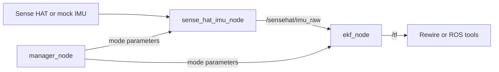

# Rotation Estimation

ROS 2 Kilted workspace for estimating IMU orientation with an error-state
extended Kalman filter (ESEKF). The repository supports both synthetic IMU data
for development and a Sense HAT connected through a small UDP bridge.

The estimator publishes orientation as a TF transform and exposes the estimated
gyroscope bias and covariance values as debug topics. A manager node provides
central service endpoints for switching the complete system between stationary
calibration and mobile estimation and for selecting mock motion.

## Packages

| Package | Purpose |
| --- | --- |
| `sense_hat_bridge` | Publishes `sensor_msgs/msg/Imu` from UDP or a synthetic IMU strategy. |
| `rotation_estimation` | Runs the ESEKF and publishes orientation and filter diagnostics. |
| `rotation_estimation_bringup` | Starts the complete system and coordinates runtime mode changes. |

## Architecture



## Requirements

- [Pixi](https://pixi.sh/) for dependencies and workspace tasks.
- A platform supported by the workspace:
  - macOS ARM64 or Linux x86-64 for development;
  - Linux ARM64 for the edge runtime.
- A Sense HAT and a system Python installation providing the `sense_hat`
  module for hardware scenarios.
- Rewire is optional and is used only to visualize the ROS graph and `/tf`.

## Installation

Clone the repository and install the development environment:

```bash
git clone https://github.com/aaaph/rotation-estimation.git
cd rotation-estimation
pixi install -e dev-runtime
pixi run build
```

Run the full verification suite:

```bash
pixi run check
```

The workspace uses `rmw_zenoh_cpp`. Start a local Zenoh router before starting
ROS nodes:

```bash
pixi run zenohd
```

Use separate terminals for the router, bringup process, and ROS CLI commands.

## Mock Quick Start

Start the complete system with a stationary synthetic IMU:

```bash
pixi run bringup_mock
```

This starts:

- `/sense_hat_imu_node`;
- `/ekf_node`;
- `/manager_node`.

Inspect the main topics:

```bash
pixi run ros2 topic echo /sensehat/imu_raw
pixi run ros2 topic echo /tf
pixi run ros2 topic echo /rotation_estimation/gyro_bias
```

Open Rewire, connect it to the same ROS graph, and visualize `/tf` to observe
the estimated orientation.

## Runtime Services

Switch the complete system to mobile mode:

```bash
pixi run ros2 service call \
  /manager_node/set_system_mode \
  rotation_estimation_bringup/srv/SetSystemMode \
  "{mode: mobile}"
```

Switch it back to stationary mode:

```bash
pixi run ros2 service call \
  /manager_node/set_system_mode \
  rotation_estimation_bringup/srv/SetSystemMode \
  "{mode: stationary}"
```

Change the synthetic motion strategy:

```bash
pixi run ros2 service call \
  /manager_node/set_mock_strategy \
  rotation_estimation_bringup/srv/SetMockStrategy \
  "{strategy: yaw_oscillation}"
```

Supported mobile mock strategies are:

- `yaw_rotation`;
- `yaw_oscillation`.

When the system is stationary, `set_mock_strategy` stores the requested
strategy but does not start synthetic motion. The strategy becomes active after
the system enters mobile mode.

## Behavior Scenarios

### Scenario 0: Stationary mock produces identity

1. Start the Zenoh router.
2. Start stationary mock bringup:

   ```bash
   pixi run bringup_mock
   ```

3. Observe `/tf` in Rewire or with `ros2 topic echo`.

Expected behavior:

- IMU angular velocity is zero;
- acceleration is `[0, 0, 9.80665]` m/s^2;
- the quaternion remains normalized;
- orientation remains approximately identity:
  `x = 0`, `y = 0`, `z = 0`, `|w| = 1`.

This behavior is also covered by the
`launch_test_bringup_stationary_identity.launch.py` launch test.

### Scenario 1: Mobile mock changes orientation

1. Start stationary mock bringup and allow the filter to receive stationary
   samples:

   ```bash
   pixi run bringup_mock
   ```

2. Switch to mobile mode:

   ```bash
   pixi run ros2 service call \
     /manager_node/set_system_mode \
     rotation_estimation_bringup/srv/SetSystemMode \
     "{mode: mobile}"
   ```

3. Change the active strategy:

   ```bash
   pixi run ros2 service call \
     /manager_node/set_mock_strategy \
     rotation_estimation_bringup/srv/SetMockStrategy \
     "{strategy: yaw_oscillation}"
   ```

Expected behavior:

- `/sensehat/imu_raw` contains a non-zero `angular_velocity.z`;
- the published orientation changes around yaw;
- roll and pitch remain gravity-aligned;
- `yaw_rotation` produces continuous yaw rotation;
- `yaw_oscillation` produces alternating yaw angular velocity.

### Scenario 2: Hardware stationary bias estimation

1. Start hardware bringup as described in
   [Sense HAT Hardware](#sense-hat-hardware).
2. Place the device on a stable surface and do not move it.
3. Observe the bias estimate:

   ```bash
   pixi run -e edge-runtime ros2 topic echo \
     /rotation_estimation/gyro_bias
   ```

4. Keep the device stationary for at least 10 seconds so that the bias window
   represents the intended calibration interval.

Expected behavior:

- the filter estimates the zero-rate gyroscope offset;
- the estimated bias is not required to be zero;
- the estimate should settle around the local mean of the stationary sensor
  readings;
- roll and pitch remain aligned with gravity.

Movement, cable tension, or impacts violate the stationary assumption and can
corrupt the calibration.

### Scenario 3: Hardware transition to mobile estimation

1. Complete the stationary calibration interval from Scenario 2.
2. Switch the system to mobile mode:

   ```bash
   pixi run -e edge-runtime ros2 service call \
     /manager_node/set_system_mode \
     rotation_estimation_bringup/srv/SetSystemMode \
     "{mode: mobile}"
   ```

3. Observe `/tf` and `/rotation_estimation/gyro_bias`.

Expected behavior:

- the filter replaces the current bias with the mean from the recent
  stationary window and freezes it;
- the published bias remains constant while mobile mode is active;
- orientation prediction integrates `gyro - frozen_bias`;
- accelerometer updates correct roll and pitch when acceleration is compatible
  with gravity;
- yaw has no absolute correction and may accumulate drift.

## Sense HAT Hardware

Install the edge environment:

```bash
pixi install -e edge-runtime
```

Verify that the system Python used on the device can import the Sense HAT
library:

```bash
/usr/bin/python3 -c "import sense_hat"
```

Start the hardware pipeline in separate terminals:

```bash
# Terminal 1: ROS discovery router
pixi run -e edge-runtime zenohd
```

```bash
# Terminal 2: read the Sense HAT and publish UDP packets on 127.0.0.1:8765
pixi run -e edge-runtime sense_hat_udp_reader
```

```bash
# Terminal 3: bridge, estimator, and manager in stationary mode
pixi run -e edge-runtime bringup
```

The UDP reader sends raw gyroscope values in rad/s and accelerometer values in
G. The bridge converts acceleration to m/s^2 before publishing the ROS IMU
message.

For communication between multiple machines, copy `.env.example` to `.env` and
configure the Zenoh router or session endpoints for the target network.

## Topics

| Topic | Type | Description |
| --- | --- | --- |
| `/sensehat/imu_raw` | `sensor_msgs/msg/Imu` | IMU data consumed by the estimator. |
| `/tf` | `tf2_msgs/msg/TFMessage` | Estimated orientation of `sensehat_link` in the `world` frame. |
| `/rotation_estimation/gyro_bias` | `geometry_msgs/msg/Vector3Stamped` | Current gyroscope bias estimate in rad/s. |
| `/rotation_estimation/debug/rotation_covariance` | `geometry_msgs/msg/Vector3Stamped` | Rotation standard deviation in degrees. |
| `/rotation_estimation/debug/gyro_bias_covariance` | `geometry_msgs/msg/Vector3Stamped` | Gyroscope bias covariance diagonal. |

## Development

```bash
pixi run format
pixi run lint
pixi run test-cpp
pixi run test-py
pixi run check
```

`test-cpp` runs both C++ unit tests and ROS 2 launch tests registered with
CTest.

## Known Limitations

- Stationary mode currently trusts the operator; there is no automatic
  stationarity detector.
- Moving or impacting the device in stationary mode can make real angular
  velocity look like gyroscope bias.
- Accelerometer updates cannot observe yaw.
- Without a magnetometer or another heading source, yaw drift is expected.
- Dynamic linear acceleration can be mistaken for a change in gravity
  direction when it passes the acceleration norm gate.
- Bias is frozen in mobile mode, so temperature-dependent bias changes are not
  tracked until stationary calibration is enabled again.
